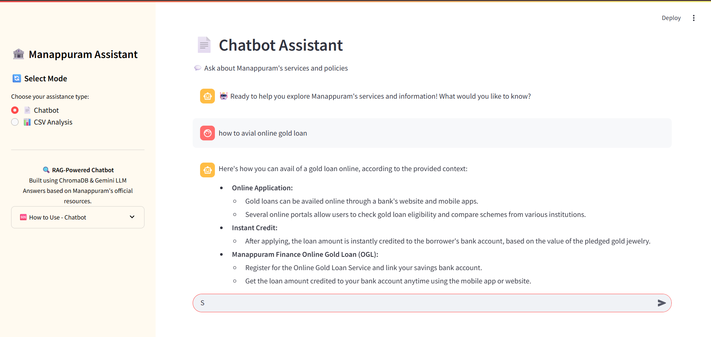
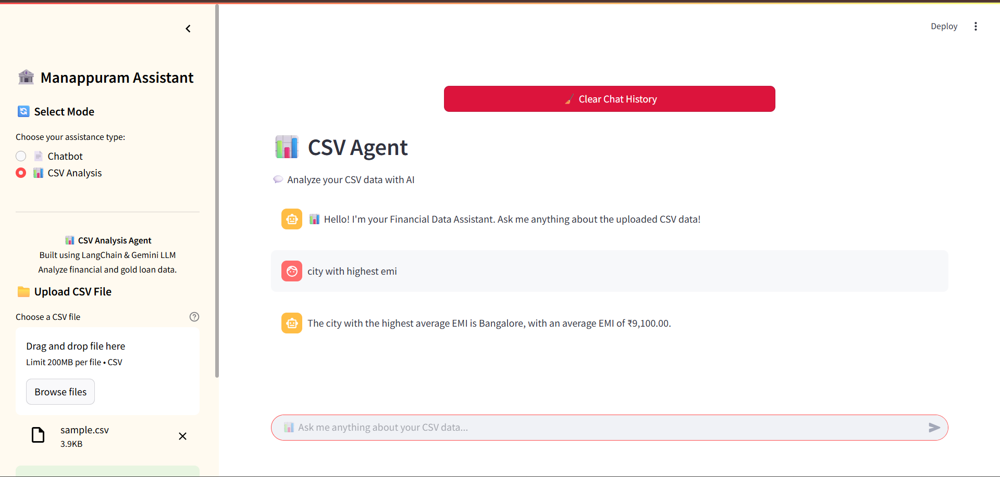

# Manappuram AI Assistant



A dual-mode AI-powered assistant built for Manappuram Finance, featuring both document-based Q&A and CSV data analysis capabilities using Google's Gemini AI and ChromaDB vector storage.

## Features

### 📄 RAG Chatbot Mode
- **Document Q&A**: Ask questions about Manappuram's services and policies
- **Vector Search**: Powered by ChromaDB with Google Generative AI embeddings
- **Source Citations**: Responses include source URLs for transparency
- **Real-time Processing**: Uses Gemini 2.0 Flash for fast responses 

### 📊 CSV Analysis Mode  
- **Financial Data Analysis**: Specialized for gold loan data analysis
- **Interactive Queries**: Ask questions about loan amounts, interest rates, gold weight/purity
- **Currency Formatting**: Automatic INR formatting and financial metrics
- **Python Code Execution**: Uses LangChain's CSV agent with code execution capabilities  

## Installation

1. **Clone the repository**
```bash
git clone https://github.com/mafil-ai/ICT-Project.git
cd ICT-Project
```

2. **Install dependencies**
```bash
pip install streamlit langchain langchain-google-genai langchain-chroma langchain-experimental chromadb python-dotenv beautifulsoup4 requests
```

3. **Set up environment variables**
Create a `.env` file in the root directory:
```env
GOOGLE_API_KEY=your_google_api_key_here
``` 

## Usage

### Running the Application
```bash
streamlit run src/agent.py
```

The application will start on `http://localhost:8501` with a sidebar for mode selection.  

### Data Setup

#### For RAG Mode
1. **Web Scraping**: Extract URLs and content from Manappuram website
```bash
# Run the scraping notebook to get URLs
python src/data.py
``` 

2. **Vector Database Setup**: Process content and create embeddings
```bash
# Run the vectordb notebook to create ChromaDB
jupyter notebook notebooks/vectordb.ipynb
``` 

#### For CSV Mode
Simply upload your CSV file through the Streamlit interface - no additional setup required.

## Project Structure

```
ICT-Project/
├── src/
│   ├── agent.py          # Main Streamlit application
│   └── data.py           # Web scraping utilities
├── notebooks/
│   ├── vectordb.ipynb    # Vector database setup
│   └── Scraping.ipynb    # URL extraction from sitemap
├── chromadb/             # ChromaDB vector storage (generated)
└── .env                  # Environment variables
```

## Technical Architecture

- **Frontend**: Streamlit with custom CSS styling
- **LLM**: Google Gemini 2.0 Flash (temperature=0.4)
- **Embeddings**: Google Generative AI text-embedding-004
- **Vector Store**: ChromaDB with persistent storage
- **CSV Processing**: LangChain experimental CSV agent
- **Web Scraping**: BeautifulSoup4 with requests 

## Sample Queries

### RAG Mode
- "What are Manappuram's gold loan interest rates?"
- "Tell me about business loan services"
- "What documents are required for vehicle loans?"

### CSV Mode  
- "What's the total loan amount across all customers?"
- "Show me customers with gold purity above 22 karat"
- "What's the average interest rate by branch?" 

## Notes

This application is designed specifically for Manappuram Finance's internal use, with specialized prompts and data processing for financial and gold loan analysis. The RAG system uses web-scraped content from Manappuram's official website, while the CSV agent is optimized for financial data analysis with INR currency formatting.